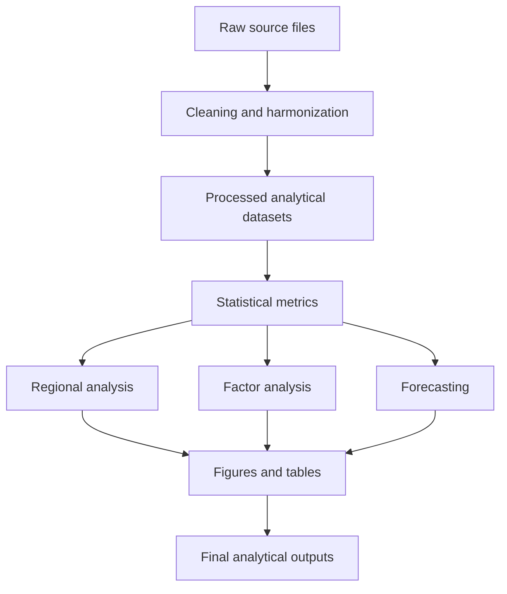
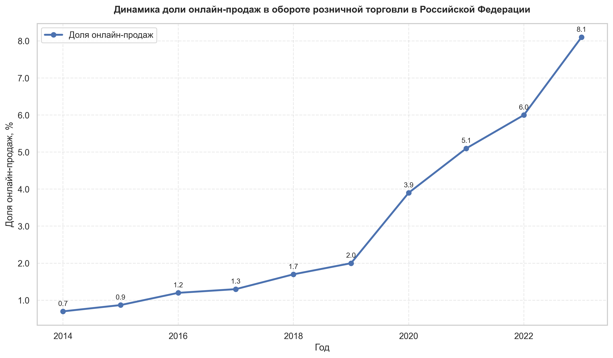
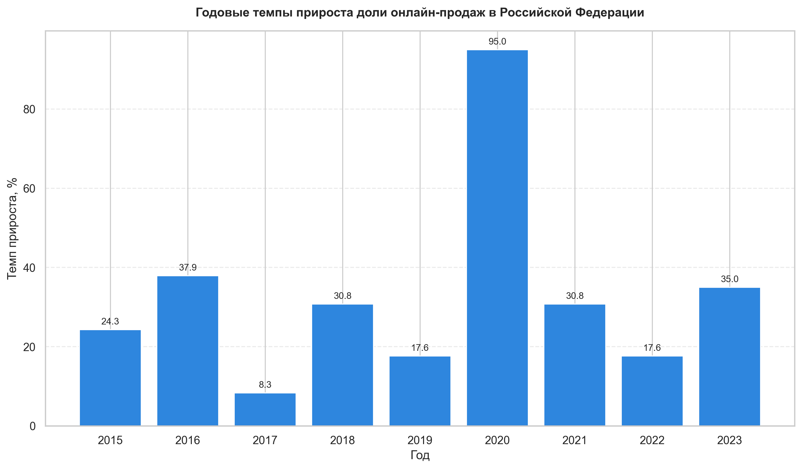
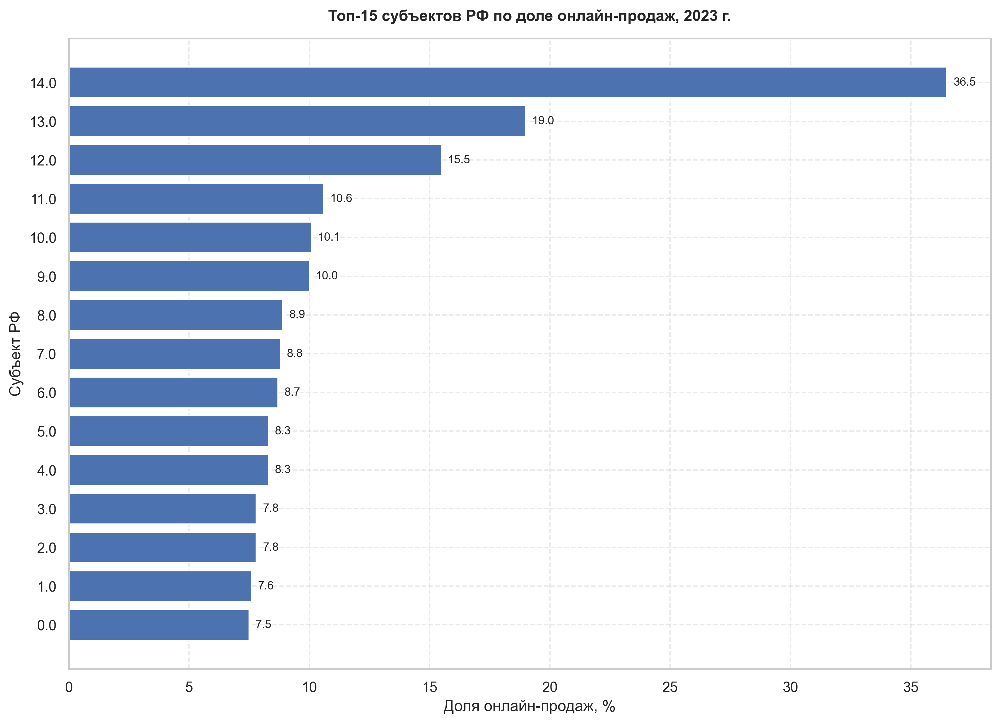
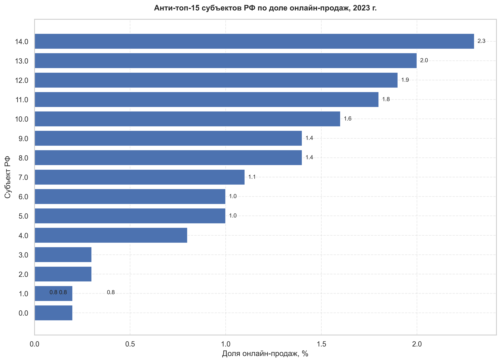
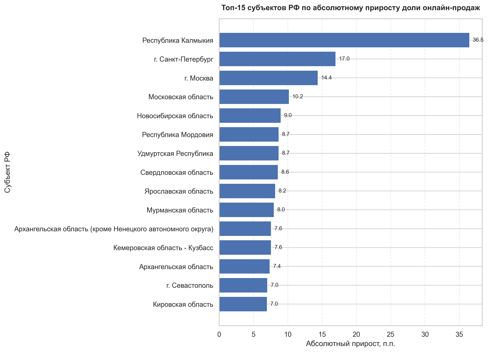
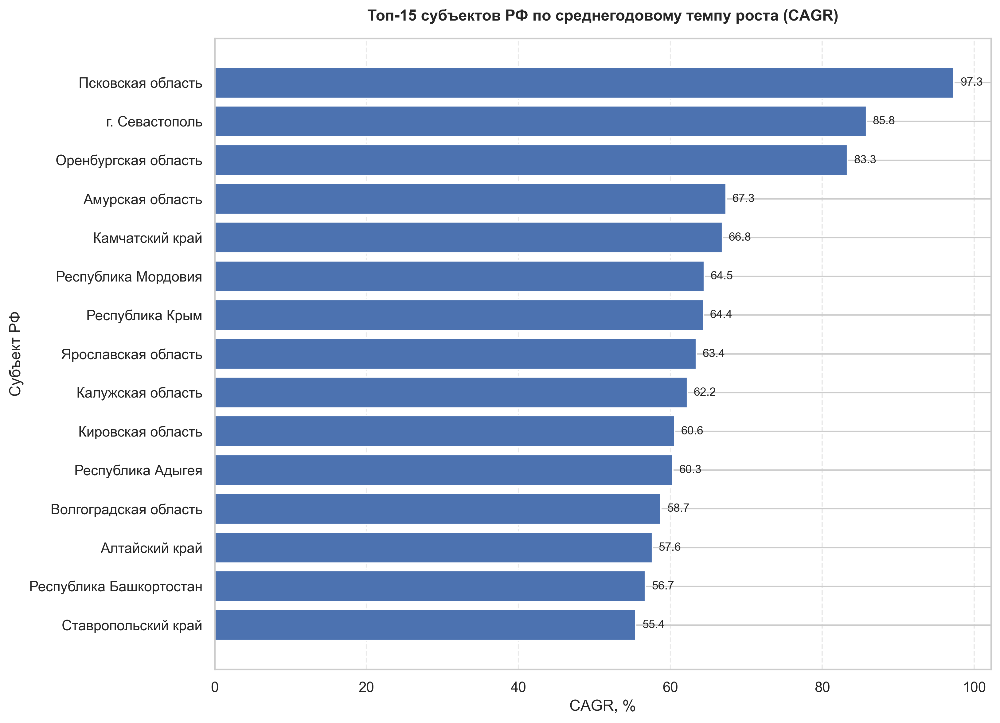
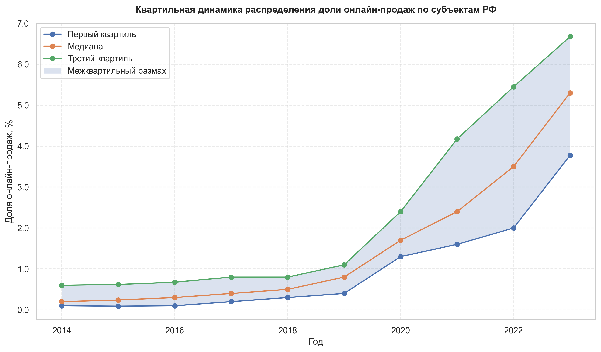
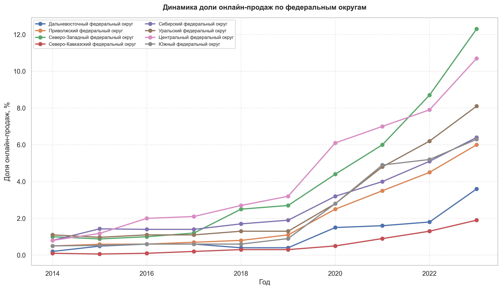
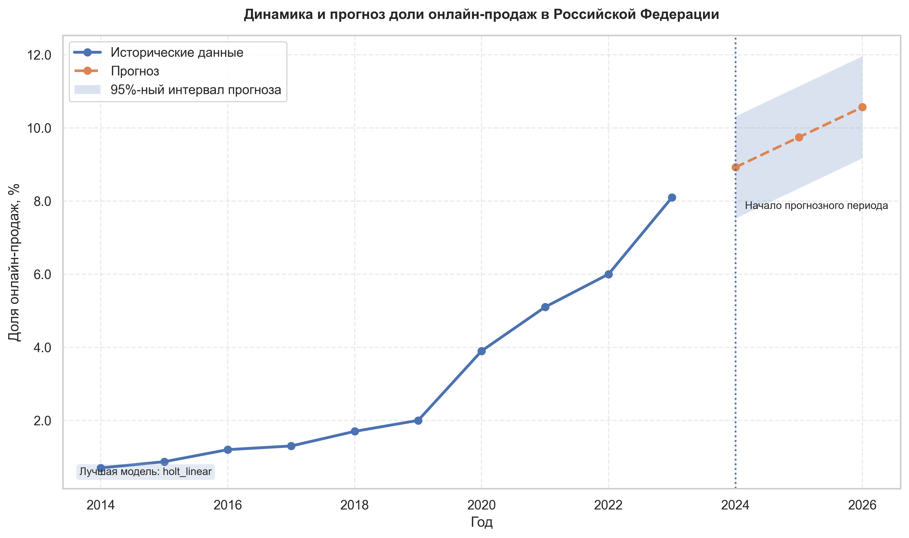

<div align="center">

# ecom-ru-stat-analysis

### Statistical analysis of the Russian e-commerce market  
### Master's thesis analytics project in **Business Informatics**

<p align="center">
  
  
  
  
</p>

<p align="center">
  Reproducible Python pipeline for collecting, transforming, analyzing, and visualizing data on the development of the Russian e-commerce market.
</p>

</div>

---

## Overview

This repository contains a full analytical pipeline created for a master's thesis devoted to the **statistical analysis of the Russian e-commerce market**.

The project combines:

- official statistical data,
- reproducible Python-based calculations,
- regional comparative analytics,
- forecasting,
- factor analysis,
- exportable figures and tables.

The repository is designed as both:

- an academic research project,
- and a portfolio-grade analytics system.

---

## Project objectives

The project is designed to solve the following analytical tasks:

- evaluate the dynamics of the share of online sales in Russian retail trade,
- identify regional leaders and outsiders,
- assess interregional differentiation,
- detect long-term growth leaders,
- compare trajectories of federal districts,
- estimate factor relationships using external variables,
- build and compare short-term forecasting models,
- export reproducible analytical outputs.

---

## Repository structure

```text
ecom-ru-stat-analysis/
├── config/
│   └── config.yaml
├── data/
│   ├── raw/
│   ├── external/
│   ├── interim/
│   └── processed/
├── notebooks/
│   ├── 01_collect.ipynb
│   ├── 02_prepare.ipynb
│   ├── 03_analysis.ipynb
│   └── 04_modeling.ipynb
├── outputs/
│   ├── figures/
│   ├── tables/
│   ├── models/
│   └── logs/
├── scripts/
│   ├── clean_project.py
│   ├── run_collect.py
│   ├── run_prepare.py
│   ├── run_analysis.py
│   ├── run_modeling.py
│   └── run_full_pipeline.py
├── src/
│   ├── collect/
│   ├── processing/
│   ├── analysis/
│   ├── modeling/
│   ├── viz/
│   └── utils/
├── tests/
├── .gitignore
├── LICENSE
├── pyproject.toml
├── README.md
└── requirements.txt
````

---

## Core functionality

The pipeline includes the following analytical blocks.

### Data preparation

* parsing Rosstat source files,
* extracting national and regional data,
* splitting subjects of the Russian Federation and federal districts,
* harmonizing datasets for further analysis.

### Statistical metrics

* absolute change,
* growth rate,
* growth increment,
* CAGR,
* quartile summaries,
* outlier detection.

### Regional analytics

* top and bottom subject rankings,
* leaders by absolute increase,
* leaders by CAGR,
* quartile dynamics,
* heatmap-ready matrices,
* federal district summaries.

### Factor analysis

* optional external factor merging,
* correlation matrix generation,
* cross-sectional regression for the latest valid year,
* export of coefficients, model fit, and regression sample.

### Forecasting

* model comparison,
* holdout-based evaluation,
* baseline forecast generation,
* confidence interval export.

### Export

* PNG graphics,
* CSV analytical tables,
* consolidated Excel workbook.

---

## Data sources

The project is based on a combination of official and auxiliary sources.

### Main source

**Rosstat**

* share of online sales in total retail turnover,
* Russian Federation level,
* subject level,
* federal district level.

### External factors

Depending on availability, the project can also integrate:

* population by region and year,
* per capita income,
* ICT-related indicators,
* payment and digital transaction indicators.

### Design principle

The project architecture supports two modes:

* a **core descriptive mode** based on the Rosstat block,
* an **extended explanatory mode** with external factors.

---

## Analytical workflow



---

## Visual showcase

### Share of online sales in Russian retail turnover

<p align="center">
  
</p>

### Annual growth increments of the online sales share

<p align="center">
  
</p>

### Top subjects of the Russian Federation by online sales share

<p align="center">
  
</p>

### Bottom subjects of the Russian Federation by online sales share

<p align="center">
  
</p>

### Leaders by absolute increase in online sales share

<p align="center">
  
</p>

### Leaders by CAGR

<p align="center">
  
</p>

### Quartile dynamics of regional distribution

<p align="center">
  
</p>

### Federal district dynamics

<p align="center">
  
</p>

### Historical trajectory and forecast

<p align="center">
  
</p>

<details>
<summary><strong>Additional figures</strong></summary>

<br>

* `./outputs/figures/subjects_boxplot_latest_year.png`
* `./outputs/figures/subjects_heatmap_top.png`
* `./outputs/figures/subjects_first_last_scatter.png`
* `./outputs/figures/subjects_factor_regression_coefficients.png` (if factor regression is available)

</details>

---

## Key outputs

### Processed datasets

Located in `data/processed/`

Main files include:

* `master_rf_dataset_with_metrics.csv`
* `master_regions_subjects_dataset_with_metrics.csv`
* `master_federal_districts_dataset_with_metrics.csv`

### Figures

Located in `outputs/figures/`

Main files include:

* `share_online_rf_dynamics.png`
* `rf_growth_increment_pct.png`
* `top_subjects_latest_year.png`
* `bottom_subjects_latest_year.png`
* `top_subjects_absolute_increase.png`
* `top_subjects_cagr.png`
* `subjects_first_last_scatter.png`
* `subjects_quartiles_by_year.png`
* `subjects_boxplot_latest_year.png`
* `subjects_heatmap_top.png`
* `federal_districts_dynamics.png`
* `rf_history_and_forecast.png`

### Tables

Located in `outputs/tables/`

Main files include:

* `top_subjects_latest_year.csv`
* `bottom_subjects_latest_year.csv`
* `subjects_first_last_comparison.csv`
* `top_subjects_absolute_increase.csv`
* `top_subjects_cagr.csv`
* `subjects_quartiles_by_year.csv`
* `subject_outliers_latest_year.csv`
* `federal_districts_latest_year.csv`
* `subjects_heatmap_matrix.csv`
* `subjects_factor_correlation_matrix.csv`
* `subjects_factor_regression_coefficients.csv`
* `subjects_factor_regression_fit.csv`
* `subjects_factor_regression_sample.csv`
* `analytical_tables.xlsx`

### Model outputs

Located in `outputs/models/`

Main files:

* `forecast_model_comparison.csv`
* `forecast_rf_values.csv`

---

## Installation

### Clone the repository

```bash
git clone https://github.com/IngannamorteScienceDev/ecom-ru-stat-analysis.git
cd ecom-ru-stat-analysis
```

### Create and activate a virtual environment

#### Windows PowerShell

```powershell
python -m venv .venv
.\.venv\Scripts\Activate.ps1
```

#### macOS / Linux

```bash
python -m venv .venv
source .venv/bin/activate
```

### Install dependencies

```bash
pip install -r requirements.txt
```

---

## Usage

### Input data placement

Source files should be placed into:

```text
data/raw/
data/external/
```

Typical raw source file:

```text
data/raw/rosstat_share_online_regions.xlsx
```

Supported external factor filenames:

* `population_by_region_year.csv`
* `income_pc_by_region_year.csv`
* `online_buyers_pct_by_region_year.csv`
* `cashless_payments_index_by_region_year.csv`

Expected long format for external factors:

```csv
region,year,factor_name
Алтайский край,2022,123.45
...
```

The value column must match the factor name expected in `config/config.yaml`.

### Full pipeline run

```bash
python scripts/run_full_pipeline.py
```

This command:

* removes generated artifacts and cache,
* rebuilds processed data,
* recalculates metrics,
* runs structural analytics,
* runs factor analysis,
* compares and builds forecast models,
* generates figures,
* exports tables.

### Step-by-step execution

```bash
python scripts/run_prepare.py
python scripts/run_modeling.py
python scripts/run_analysis.py
```

---

## Generated files by stage

### Preparation

* cleaned RF dataset,
* cleaned regional dataset,
* subject-level and federal district processed layers,
* optional external factor merge.

### Analysis

* rankings,
* quartiles,
* outlier tables,
* comparative plots,
* heatmap matrix,
* factor matrices and regression outputs.

### Forecasting

* model comparison table,
* final forecast table with interval.

### Export

* consolidated Excel workbook,
* figure set,
* model outputs.

---

## Methodological notes

### Territorial hierarchy

The project explicitly separates:

* Russian Federation,
* federal districts,
* subjects of the Russian Federation.

This avoids methodological distortion in comparative analytics.

### Forecasting approach

The forecasting block uses practical model comparison:

* naive benchmark,
* linear trend,
* Holt linear trend.

The best model is selected using holdout-period error metrics.

### Factor analysis logic

The factor block is designed to remain usable even with imperfect external coverage:

* it searches for the latest year with sufficient common factor data,
* builds a valid regional sample,
* estimates cross-sectional regression,
* exports interpretable outputs.

### Reproducibility

The repository is structured around a reproducible workflow:

* source data are preserved,
* generated artifacts are rebuilt automatically,
* tables and figures can be reproduced before defense or review.

---

## Troubleshooting

<details>
<summary><strong>ModuleNotFoundError: No module named 'src'</strong></summary>

All project scripts inject the project root into `sys.path`.
Run commands from the repository root.

</details>

<details>
<summary><strong>Forecast file not found</strong></summary>

Run the full pipeline:

```bash
python scripts/run_full_pipeline.py
```

</details>

<details>
<summary><strong>Factor regression sample is empty</strong></summary>

This means the external factor files do not overlap sufficiently by:

* region,
* year,
* variable availability.

Check:

* filenames,
* column names,
* year coverage,
* consistency of region labels.

</details>

<details>
<summary><strong>Figures do not render in GitHub README</strong></summary>

Make sure the image files are tracked by Git and pushed to the repository:

```bash
git add -f outputs/figures/*
git commit -m "docs: add generated figures for README showcase"
git push
```

</details>

---

## Future improvements

Potential extensions:

* richer panel factor modeling,
* automated downloaders for public source files,
* geospatial map-based analytics,
* dashboard layer for interactive exploration,
* formal report generation.

---

## Author

**Yulia Liubushkina**
GitHub: [@ZeroZivi](https://github.com/ZeroZivi)

---

## License

This repository is provided for academic and research purposes.
See [`LICENSE`](./LICENSE) for details.
